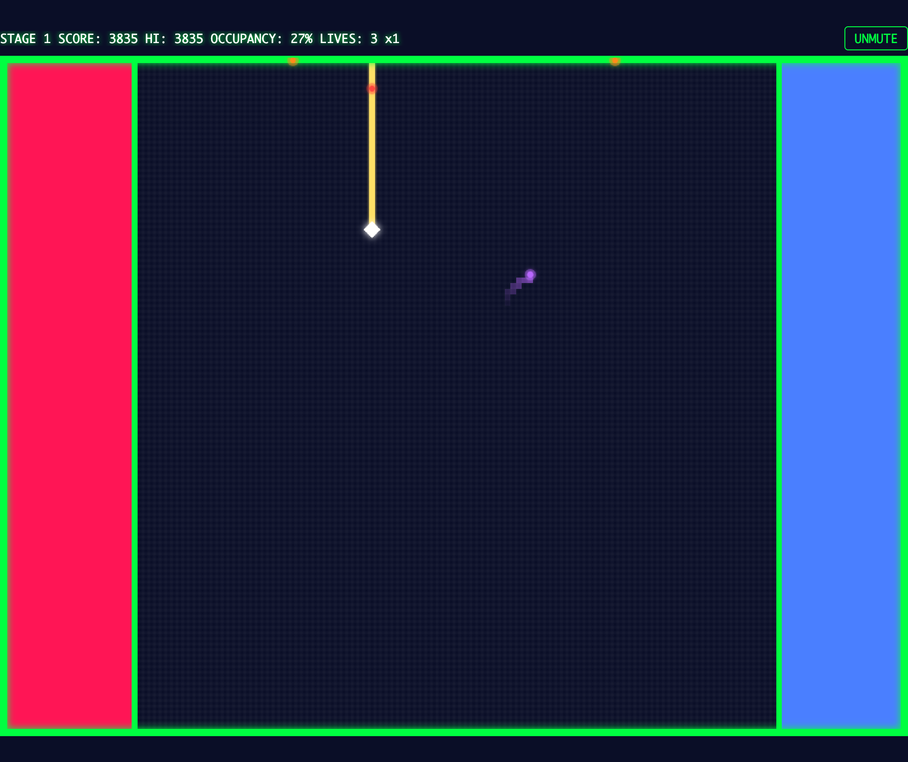
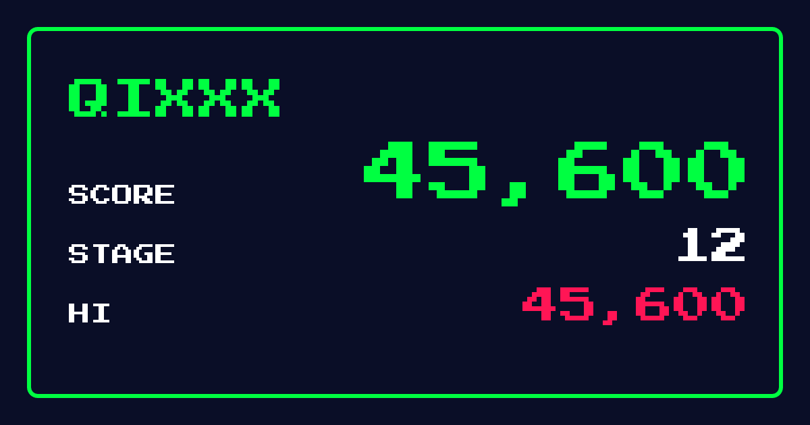
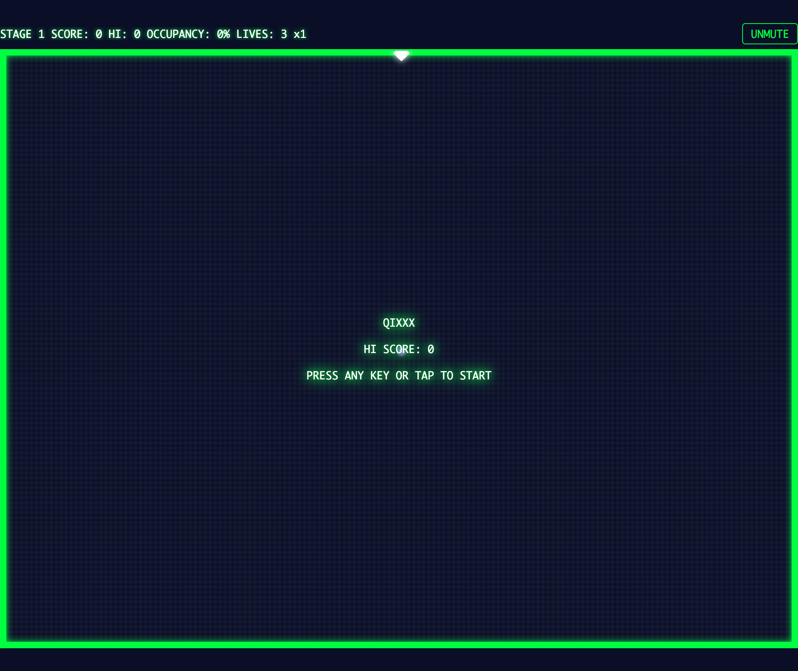
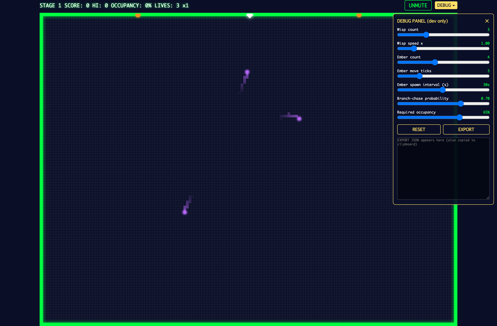

# QIXXX（キックス）

線を引いて陣地を切り取る、ネオン風の陣取りアクションゲーム。
1981 年のアーケードゲーム QIX へのオマージュとして、メカニクスは原作準拠・名称やビジュアルはオリジナルで作られています。



敵に触れないようにフィールドへラインを引き、**占有率が目標値に達したらステージクリア**。
目標値はステージ 1 が **65%**、ステージが進むごとに少しずつ上がり、ステージ 10 で最大の **90%** になります。敵（ウィスプ）もステージごとに増え、ステージ 10 で最大の **10 匹**に到達します（速度・出現間隔なども同時に最大まで上昇し、11 面以降はその最大値のまま据え置きです）。
敵が 2 匹以上いるステージでは、ラインで敵同士を**分断**すると占有率に関係なく即クリア（一発逆転の大技）。
デスクトップ（キーボード）とスマホ（タッチ）の両方で遊べます。

ゲームオーバー時には、そのプレイのスコアを **X（旧 Twitter）にシェア**できます。スコア入りのカード画像付きで投稿されます。



**➡️ 詳しいルールと遊び方: [遊び方ガイド](docs/how-to-play.md)**

## 遊ぶ

**🎮 ブラウザですぐ遊べます: https://app.orukubami.sh/qixxx/**

ローカルで動かす場合:

```bash
npm install
npm run dev
```

表示された URL（例: `http://localhost:5173/qixxx/`）をブラウザで開き、何かキーを押す（タップする）とスタートします。



> 🔊 **効果音があります（初回はミュート）。** 画面右上の **UNMUTE ボタン**を押すと、ライン引き・エリア確定・ミスなどに合わせて音が鳴ります。設定は保存され、次回以降も引き継がれます。

### 基本操作（デスクトップ）

| 操作 | キー |
|---|---|
| 移動 | 矢印キー / `H` `J` `K` `L`（Vim 風） |
| 高速ライン | `X` / `Space` を押しながら移動 |
| 低速ライン（2 倍得点） | `Z` / `Shift` を押しながら移動 |

スマホでは画面下部の仮想十字キーと `FAST` / `SLOW` ボタンで操作します。

> ⚠️ **キーが効かないときは:** Vimium などのブラウザ拡張が `H` `J` `K` `L` `X` `Z` といった文字キーを横取りしている可能性があります（矢印キーと Space だけ効くのが典型的な症状）。**シークレットウィンドウで開く**か、拡張の除外サイトにこのゲームの URL を追加してください。日本語入力（IME）が ON の場合も同様なので、英数モードでプレイしてください。

## 技術スタック

- TypeScript (strict) + Canvas 2D — フレームワーク・ゲームエンジン不使用
- Vite（開発・ビルド） / Vitest（ユニットテスト） / Playwright（E2E スモーク）
- 効果音は Web Audio API による実行時生成（音源アセットなし）
- ホスティングは Cloudflare Pages（app.orukubami.sh/qixxx）
- X シェアのスコアカードは Cloudflare Pages Functions + Workers KV + workers-og（Satori）でエッジ動的生成

コアロジック（`src/core/`）は DOM・Canvas 非依存の純 TypeScript で、ユニットテストで網羅しています。

## 開発コマンド

```bash
npm run dev        # 開発サーバ起動
npm run build      # プロダクションビルド（dist/）
npm test           # ユニットテスト（Vitest）
npm run e2e        # E2E スモークテスト（Playwright）
npm run lint       # ESLint
npm run typecheck  # tsc --noEmit
```

### デバッグパネル（開発用）

開発サーバで URL に `?debug` を付けると、敵の数・速度・出現間隔・要求占有率などをスライダーで即時調整できるパネルが出ます（プロダクションビルドには含まれません）。`EXPORT` でチューニング結果を JSON として書き出せます。



## ディレクトリ構成

```
src/
├── core/     # ゲームロジック（DOM 非依存・テスト対象の中心）
├── render/   # Canvas 描画
├── input/    # キーボード・タッチ入力
├── audio/    # Web Audio 効果音
├── storage/  # localStorage（ハイスコア・設定）
├── config.ts # チューニング定数・配色
├── ui/       # GAME OVER モーダル（X シェア）
└── main.ts   # エントリポイント（結線・ゲームループ）
functions/    # Cloudflare Pages Functions（シェア API・OG カード生成）
docs/
├── plan.md          # 実装計画書
└── how-to-play.md   # 遊び方ガイド
```

## ライセンス

[MIT](LICENSE)
