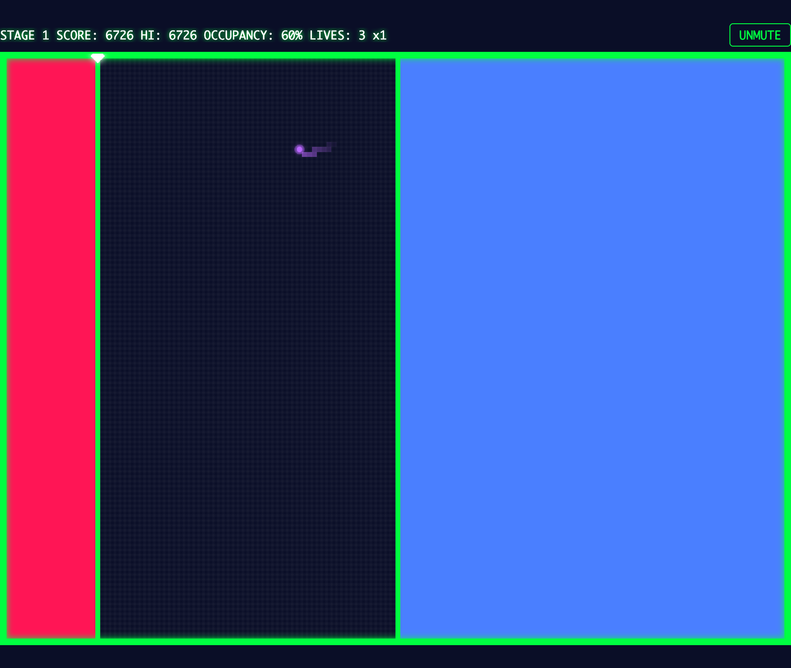

# QIXXX（キックス）

線を引いて陣地を切り取る、ネオン風の陣取りアクションゲーム。
1981 年のアーケードゲーム QIX へのオマージュとして、メカニクスは原作準拠・名称やビジュアルはオリジナルで作られています。



敵に触れないようにフィールドへラインを引き、**占有率 65% 以上**を陣地にできたらステージクリア。
敵が 2 匹いるステージでは、ラインで敵同士を**分断**すると占有率に関係なく即クリア（一発逆転の大技）。
デスクトップ（キーボード）とスマホ（タッチ）の両方で遊べます。

**➡️ 詳しいルールと遊び方: [遊び方ガイド](docs/how-to-play.md)**

## 遊ぶ

```bash
npm install
npm run dev
```

表示された URL（例: `http://localhost:5173/qixxx/`）をブラウザで開き、何かキーを押す（タップする）とスタートします。

> 🔊 **効果音が鳴ります。** ライン引き・エリア確定・ミスなどに合わせて音が出るので、音量にご注意ください。画面右上の **MUTE ボタン**でいつでも消せます（設定は保存されます）。

### 基本操作（デスクトップ）

| 操作 | キー |
|---|---|
| 移動 | 矢印キー / `W` `A` `S` `D` |
| 高速ライン | `X` / `Space` を押しながら移動 |
| 低速ライン（2 倍得点） | `Z` / `Shift` を押しながら移動 |

スマホでは画面下部の仮想十字キーと `FAST` / `SLOW` ボタンで操作します。

## 技術スタック

- TypeScript (strict) + Canvas 2D — フレームワーク・ゲームエンジン不使用
- Vite（開発・ビルド） / Vitest（ユニットテスト） / Playwright（E2E スモーク）
- 効果音は Web Audio API による実行時生成（音源アセットなし）

コアロジック（`src/core/`）は DOM・Canvas 非依存の純 TypeScript で、ユニットテストで網羅しています。

## 開発コマンド

```bash
npm run dev        # 開発サーバ起動
npm run build      # プロダクションビルド（dist/）
npm test           # ユニットテスト（Vitest）
npm run e2e        # E2E スモークテスト（Playwright）
npm run lint       # ESLint
npm run typecheck  # tsc --noEmit
```

## ディレクトリ構成

```
src/
├── core/     # ゲームロジック（DOM 非依存・テスト対象の中心）
├── render/   # Canvas 描画
├── input/    # キーボード・タッチ入力
├── audio/    # Web Audio 効果音
├── storage/  # localStorage（ハイスコア・設定）
├── config.ts # チューニング定数・配色
└── main.ts   # エントリポイント（結線・ゲームループ）
docs/
├── plan.md          # 実装計画書
└── how-to-play.md   # 遊び方ガイド
```

## ライセンス

[MIT](LICENSE)
