# QIXXX 遊び方ガイド

**QIXXX（キックス）** は、線を引いて陣地を切り取っていく「陣取りアクションゲーム」です。
敵に触れないように少しずつフィールドを塗りつぶし、**65% 以上を自分の陣地にできたらステージクリア**です。

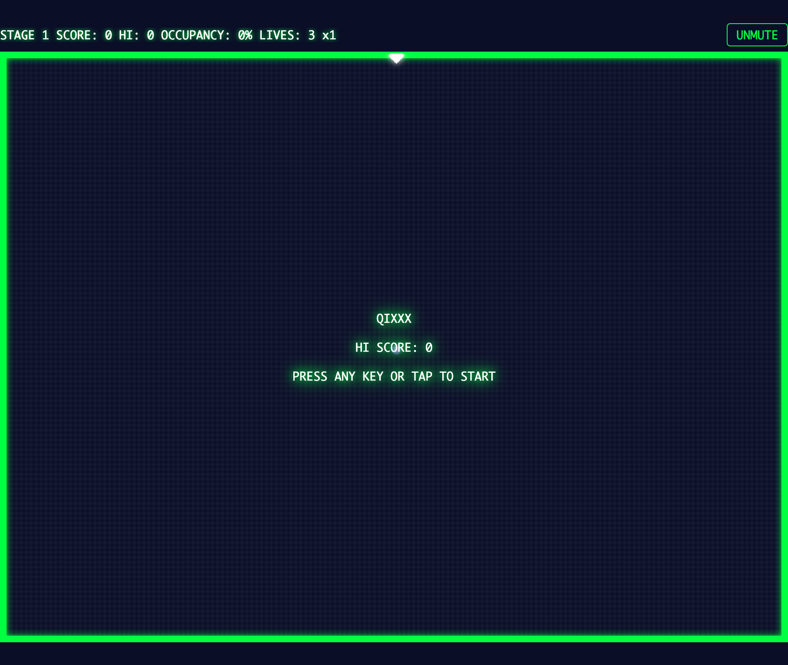

ブラウザで動きます。デスクトップ（キーボード）でもスマホ（タッチ）でも遊べます。

---

## 1. まず動かしてみる

```bash
npm install
npm run dev
```

表示された URL（例: `http://localhost:5173/qixxx/`）を開くとタイトル画面が出ます。
**何かキーを押す（スマホなら画面をタップ）** とゲームが始まります。

---

## 2. 画面の見方


| 表示 | 意味 |
|---|---|
| `STAGE 1` | 現在のステージ番号 |
| `SCORE` | 現在のスコア |
| `HI` | ハイスコア（ブラウザに保存され、次回も残ります） |
| `OCCUPANCY` | **占有率**。フィールドの何 % を陣地にしたか。これが目標値（ステージ 1〜2 は 65%）に達するとクリア |
| `LIVES` | 残りライフ。**3 からスタート、0 でゲームオーバー** |
| `x1` | 得点倍率（後述の「分断ボーナス」で上がります） |
| `MUTE` ボタン | 効果音のオン/オフ。設定は保存されます |

---

## 3. 操作方法

### デスクトップ（キーボード）

| 操作 | キー |
|---|---|
| 移動 | 矢印キー または `W` `A` `S` `D` |
| **高速ライン**を引く | `X` または `Space` を**押しながら**移動 |
| **低速ライン**を引く（高得点） | `Z` または `Shift` を**押しながら**移動 |
| 画面を進める（タイトル・クリア・ゲームオーバー） | 何かキーを押す |

### スマホ（タッチ）

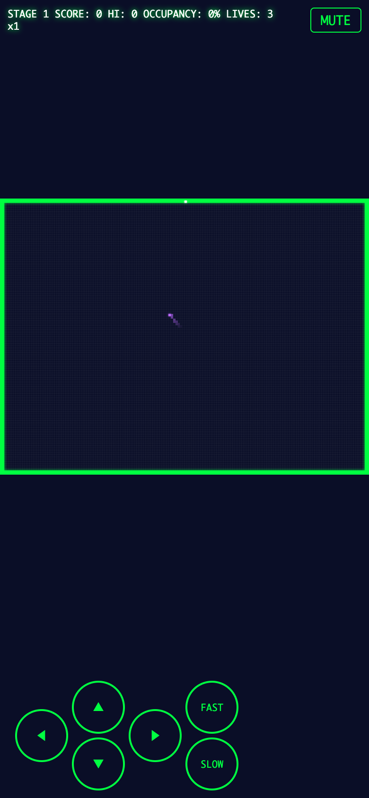

- **左下の十字キー**で移動、**右下の `FAST` / `SLOW` ボタン**がライン用ボタンです
- ボタンを**押しながら**十字キーを押すとラインが引けます（同時押し対応）
- タイトルなどの画面は**画面のどこかをタップ**で進みます

---

## 4. 基本ルール — 線を引いて陣地を取る

### 4-1. ふだんは「枠の上」しか動けない

白い点があなたの操作する **マーカー（自機）** です。
マーカーは**緑色の境界線の上だけ**を自由に移動できます。フィールドの内側には勝手に入れません。

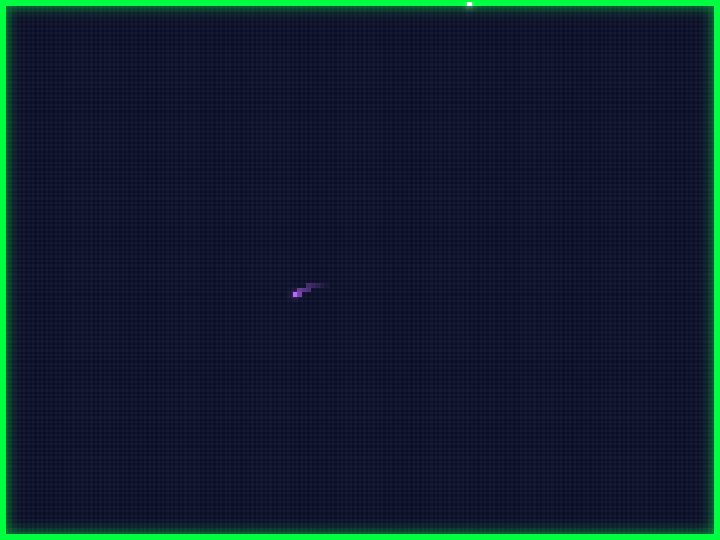

### 4-2. ラインボタンを押しながら進むと「線」が引ける

`X`/`Space`（または `FAST` ボタン）を**押しながら**フィールド内側へ進むと、
移動した跡が**黄色いライン**になります。

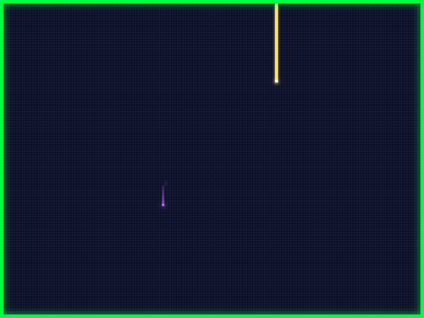

### 4-3. 反対側の境界線に届くと、面が確定する

ラインが別の境界線にたどり着くと線が閉じて、**フィールドが 2 つに分かれ、
「敵がいない側」が自分の陣地として塗りつぶされます**。

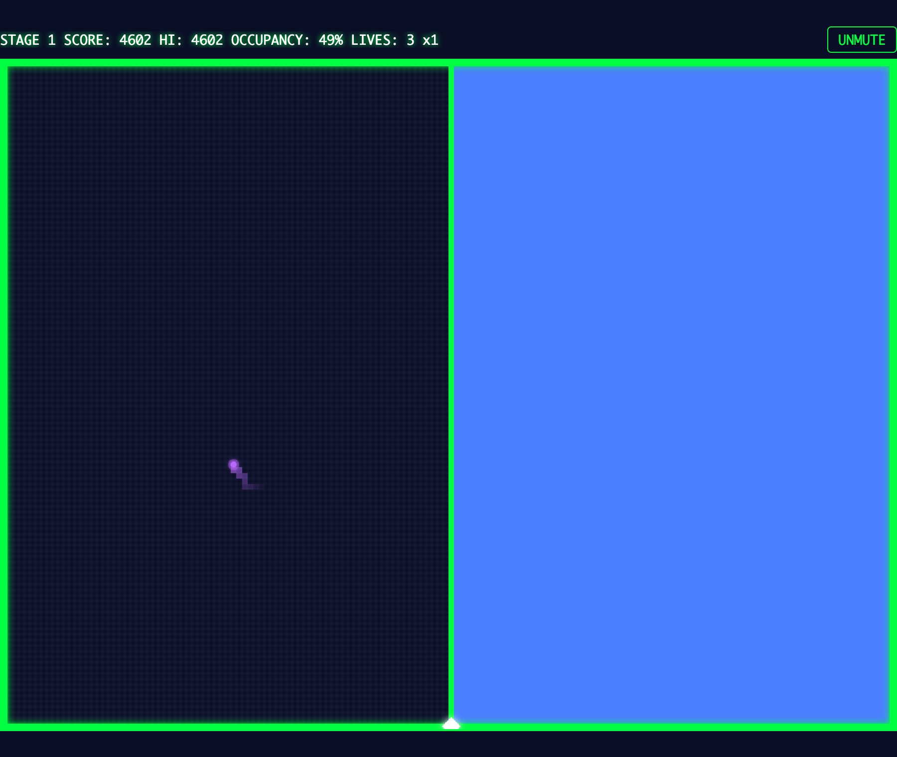

- 塗られた分だけ **OCCUPANCY（占有率）が増え、スコアが入ります**
- 敵がいる側は塗られません。**敵をどれだけ狭い場所に追い込んで大きく塗るか**がこのゲームの醍醐味です

### 4-4. 低速ライン（SLOW）は倍のスコア

`Z`/`Shift`（または `SLOW` ボタン）で引くと移動速度が**半分**になる代わりに、
確定したエリアの得点が **2 倍**になります。低速で取ったエリアは**赤色**で塗られます。


> ⚠️ 1 本のラインの途中で高速・低速を切り替えた場合は「高速で引いた」扱いになります。
> 全部を低速で引き切ったときだけ 2 倍です。

### 4-5. 引き返したくなったら「引き戻し」

ラインを引いている途中で**来た道を逆方向に入力**すると、ラインを末尾から消しながら後退できます。
開始地点まで戻れば、何もなかったことにしてやり直せます。

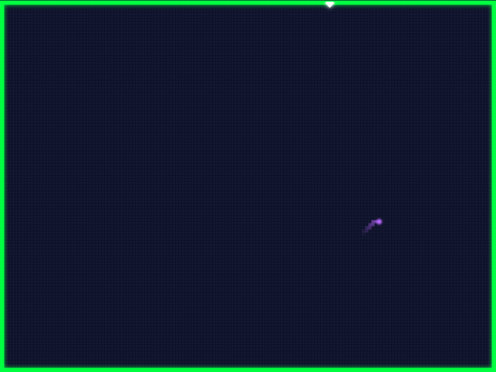

> ⚠️ 後述の**イグナイター（導火線の敵）が出現すると引き戻しできなくなります**。

---

## 5. 敵は 3 種類

### ウィスプ（Wisp）— フィールド内をさまよう本体

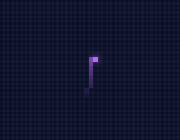

- フィールドの**未確定エリア内**をランダムに漂います
- **引いている途中のラインやマーカーに触れられるとミス**
- 確定済みの境界線の上にいるマーカーには**無害**です。枠の上にいれば安全
- こいつがいる側は陣地にならないので、動きを読んで反対側を切り取りましょう

### エンバー（Ember）— 境界線を巡回する追っ手

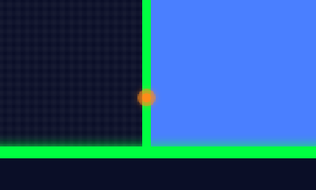

- 一定時間ごとに**画面上部から 2 体**現れ、**境界線の上**を移動してマーカーを追いかけます
- **接触するとミス**。枠の上に居座っていると追い詰められます
- ライン引き中（フィールド内側）には追ってこられません

### イグナイター（Igniter）— ラインを伝う導火線

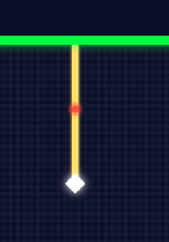

- ライン引きの途中で**約 1 秒立ち止まる**と、ラインの根元から出現します
- **あなたが止まっている間だけ**ライン上を迫ってきます。動けば止まります
- **追いつかれるとミス**。出現したら引き戻しもできません — 迷わず線を引き切りましょう

---

## 6. ミスとライフ


ミスになるのは次の 3 つです。

1. ウィスプが引いている途中のライン（またはライン上のマーカー）に触れた
2. エンバーがマーカーに接触した
3. イグナイターに追いつかれた

ミスをすると:

- 引いていたラインは**消滅**し、マーカーは**ライン開始地点に戻ります**
- **ライフが 1 減り**、得点倍率が **x1 にリセット**されます
- 直後の **約 2 秒間は無敵**なので、落ち着いて立て直せます

**ライフが 0 になるとゲームオーバー**です。

---

## 7. ステージクリアと難易度

占有率が目標値に達した瞬間、ステージクリアです。目標を超えた分は**ボーナス得点**になります。

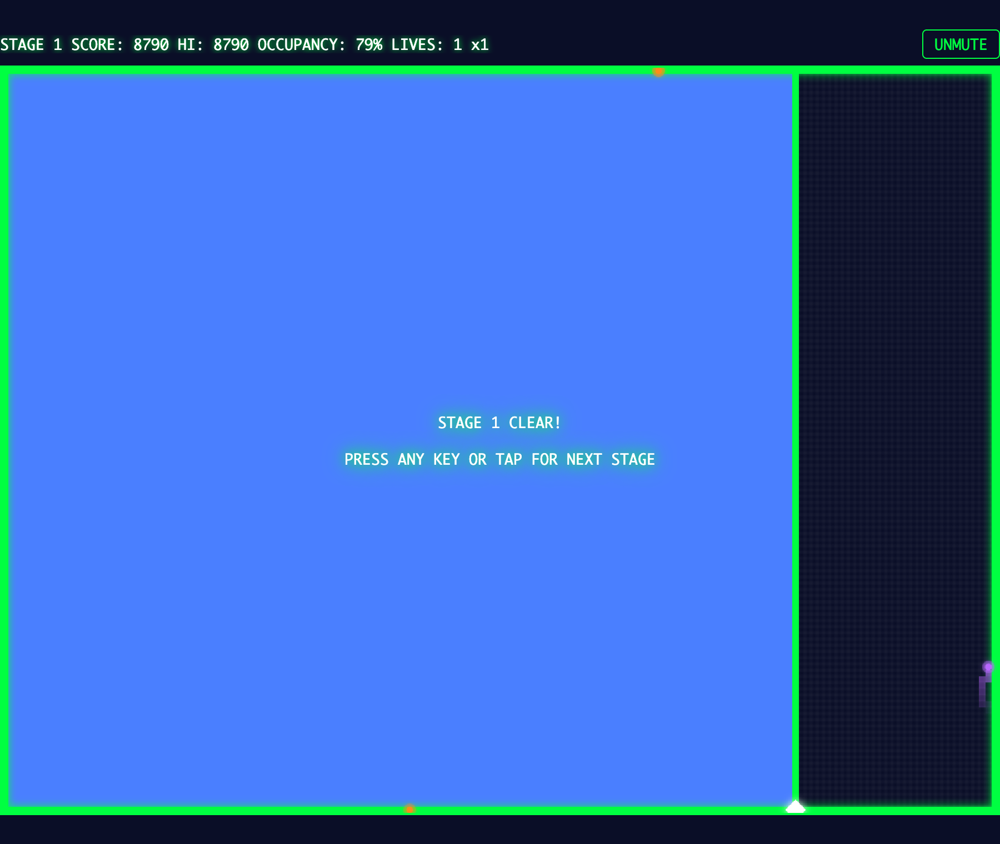

ステージが進むと難しくなります:

| ステージ | ウィスプ | 速度 | エンバー出現間隔 | 目標占有率 |
|---|---|---|---|---|
| 1 | 1 匹 | 基準 | 30 秒 | 65% |
| 2 | 1 匹 | 1.15 倍 | 25 秒 | 65% |
| 3 以降 | **2 匹** | だんだん速く（上限 2 倍） | だんだん短く（下限 10 秒） | 67% → 最大 75% |

スコアとライフは次のステージに引き継がれます。

---

## 8. 分断ボーナス — 一発逆転の大技

ステージ 3 からはウィスプが **2 匹**になります。

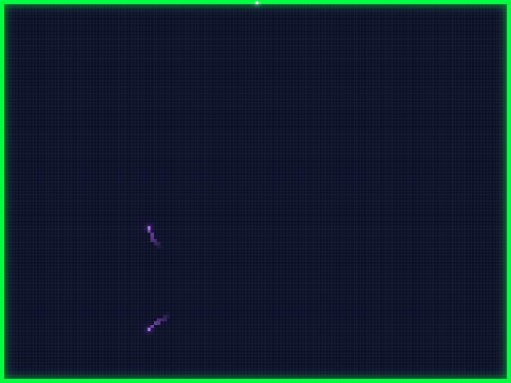

ここで狙えるのが**分断（スプリット）**です。
**2 匹のウィスプを 1 本のラインで別々の領域に切り分ける**と——

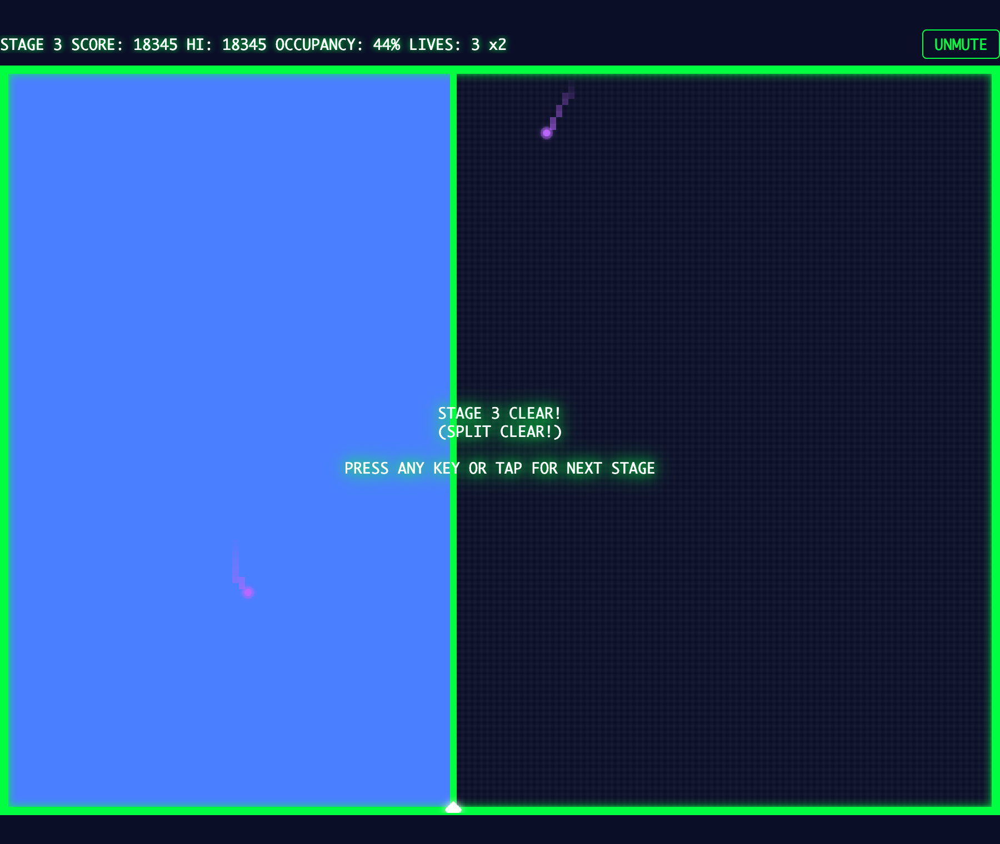

- **占有率に関係なく、その場で即ステージクリア!**（たとえ 10% 台でも）
- さらに次のステージから**得点倍率が上がります**（成功回数 +1 倍、最大 9 倍）
- ただし**一度でもミスすると倍率は x1 に戻ります**

分断の形は 2 通りあります。どちらも成立します。

1. **真っ二つ**: フィールドを横断するラインで、2 匹を左右（上下）の別領域に分ける
2. **閉じ込め**: 片方のウィスプごと小さく囲い込む。囲った側は確定エリアになり、中のウィスプと外のウィスプが「別々の領域」になるので分断成立

ハイスコアを狙うなら、リスクを取ってでも分断を決め続けるのが最短ルートです。

---

## 9. ゲームオーバーとハイスコア

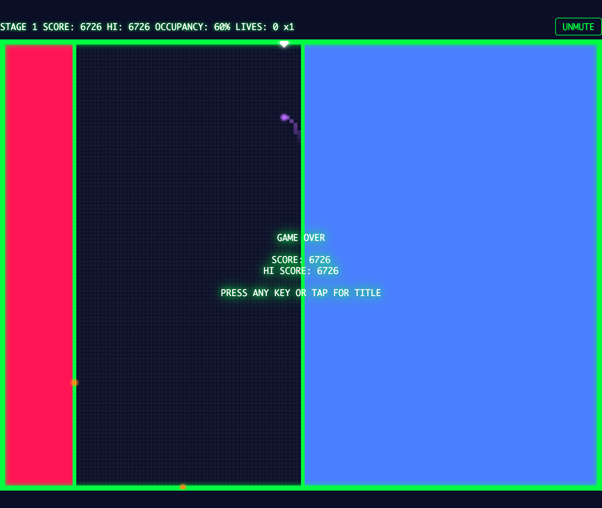

ライフが 0 になるとゲームオーバー。何かキー（タップ）でタイトルに戻ります。
**ハイスコアはブラウザに自動保存**され、次回起動時のタイトル画面に表示されます。

---

## 10. スコアまとめ

| 行動 | 得点 |
|---|---|
| 高速ラインでエリア確定 | 面積（セル数）× **0.5 点** × 倍率 |
| 低速ラインでエリア確定 | 面積（セル数）× **1.0 点** × 倍率 |
| ステージクリア時の超過ボーナス | （達成占有率 − 目標占有率）× 100 点 |
| 分断成功 | 即クリア + 次ステージから倍率アップ（最大 x9） |

---

## 11. 上達のコツ

- **最初は端から小さく削る。** 欲張って真ん中に長い線を引くほど、ウィスプに触られる時間が長くなります
- **ウィスプの位置を見てから引く。** 塗られるのは「ウィスプがいない側」。ウィスプが端に寄った瞬間が大きく取るチャンス
- **立ち止まらない。** ライン引き中に迷って止まるとイグナイターが出ます。引き始めたら一気に
- **低速ラインは仕上げに。** 残りわずかで安全な場所を低速で取ると、スコアが効率よく伸びます
- **エンバーの気配を感じたら移動。** 枠の上も安全地帯ではありません。同じ場所に留まらないこと
