# QIXXX 遊び方ガイド

**QIXXX（キックス）** は、線を引いて陣地を切り取っていく「陣取りアクションゲーム」です。
敵に触れないように少しずつフィールドを塗りつぶし、**目標占有率（ステージ 1 は 65%。ステージが進むごとに上がり、ステージ 10 で最大の 90%）に達したらステージクリア**です。

**1 プレイは実質 3 分間の時間制限つき。** 制限時間が尽きると、ライフが何個残っていても関係なく **TIME UP** でゲームオーバーになります。「3 分でどこまで稼げるか」が勝負です。

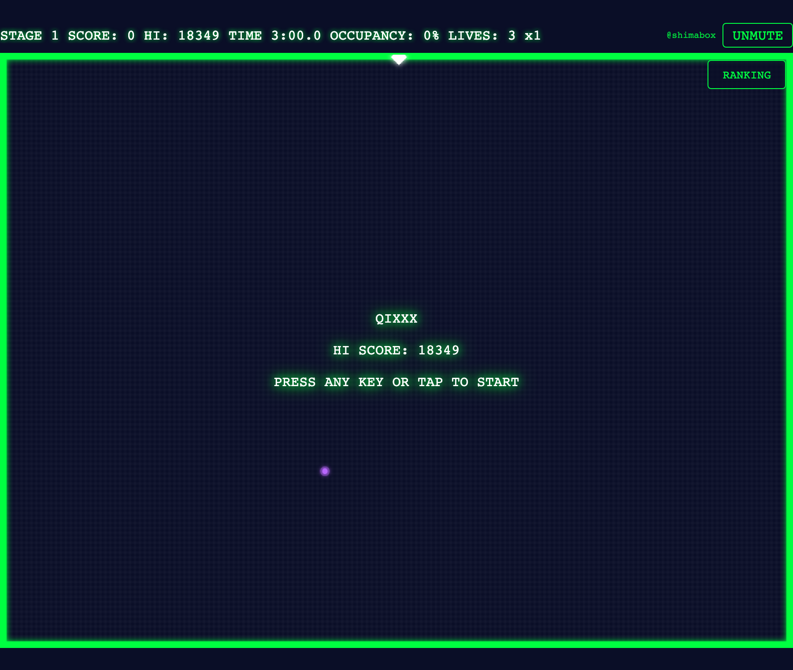

ブラウザで動きます。デスクトップ（キーボード）でもスマホ（タッチ）でも遊べます。

---

## 1. まず動かしてみる

**🎮 ブラウザですぐ遊べます: https://qixxx.orukubami.sh/**

ローカルで動かす場合:

```bash
npm install
npm run dev
```

表示された URL（例: `http://localhost:5173/`）を開くとタイトル画面が出ます。
**何かキーを押す（スマホなら画面をタップ）** とゲームが始まります。
タイトル画面の右上にある **RANKING** ボタンを押すと、オンラインランキングを開けます（詳しくは 10 章）。

---

## 2. 画面の見方


| 表示 | 意味 |
|---|---|
| `STAGE 1` | 現在のステージ番号 |
| `SCORE` | 現在のスコア |
| `HI` | ハイスコア（ブラウザに保存され、次回も残ります） |
| `TIME` | **残り時間のカウントダウン**（例 `2:59.9`）。1 プレイの持ち時間は実質 3 分固定で、0 になると即 TIME UP。**残り 30 秒を切ると文字色が警告色（赤）に変わります** |
| `OCCUPANCY` | **占有率**。フィールドの何 % を陣地にしたか。これが目標値（ステージ 1 は 65%。ステージが進むごとに上がり、ステージ 10 で最大の 90%）に達するとクリア |
| `LIVES` | 残りライフ。**3 からスタート、0 でゲームオーバー**（ライフが残っていても、TIME が 0 になれば同様にゲームオーバーです） |
| `x1` | 得点倍率（後述の「分断ボーナス」で上がります） |
| `MUTE`/`UNMUTE` ボタン | 効果音のオン/オフ。**初回はミュート**なので、音を出したいときは `UNMUTE` を押してください。設定は保存されます |

---

## 3. 操作方法

### デスクトップ（キーボード）

| 操作 | キー |
|---|---|
| 移動 | 矢印キー / `H` `J` `K` `L`（Vim 風: H=左 J=下 K=上 L=右） |
| **高速ライン**を引く | `X` または `Space` を**押しながら**移動 |
| **低速ライン**を引く（高得点） | `Z` または `Shift` を**押しながら**移動 |
| 画面を進める（タイトル・クリア・ゲームオーバー） | 何かキーを押す |

> ⚠️ **文字キー（H/J/K/L/X/Z）が効かないときは:** Vimium などのブラウザ拡張がキーを横取りしているか、日本語入力（IME）が ON になっています。矢印キーと Space だけ効くのが典型的な症状です。**シークレットウィンドウで開く**・拡張の除外サイトに追加する・英数モードに切り替える、のいずれかで解決します。

### スマホ（タッチ）

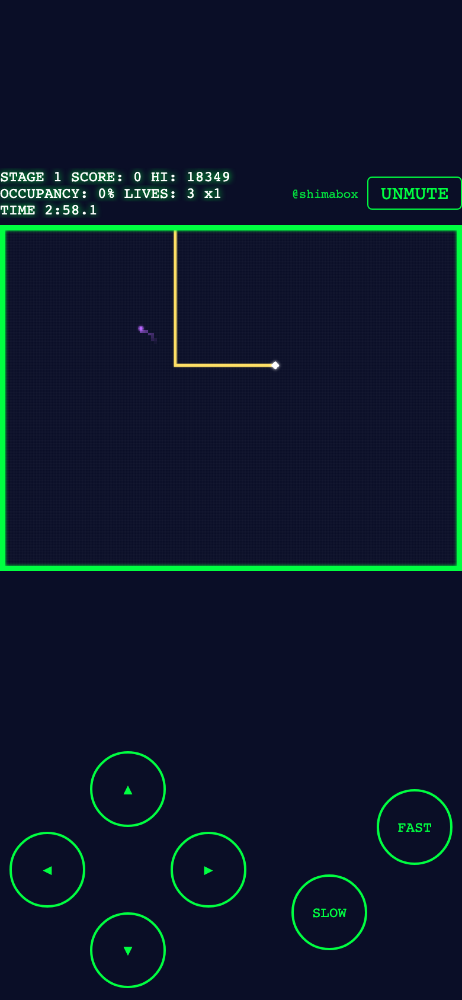

- **左下の十字キー**で移動、**右下の `FAST` / `SLOW` ボタン**がライン用ボタンです
- ボタンを**押しながら**十字キーを押すとラインが引けます（同時押し対応）
- タイトルなどの画面は**画面のどこかをタップ**で進みます

---

## 4. 基本ルール — 線を引いて陣地を取る

### 4-1. ふだんは「枠の上」しか動けない

白い点があなたの操作する **マーカー（自機）** です。
マーカーは**緑色の境界線の上だけ**を自由に移動できます。フィールドの内側には勝手に入れません。

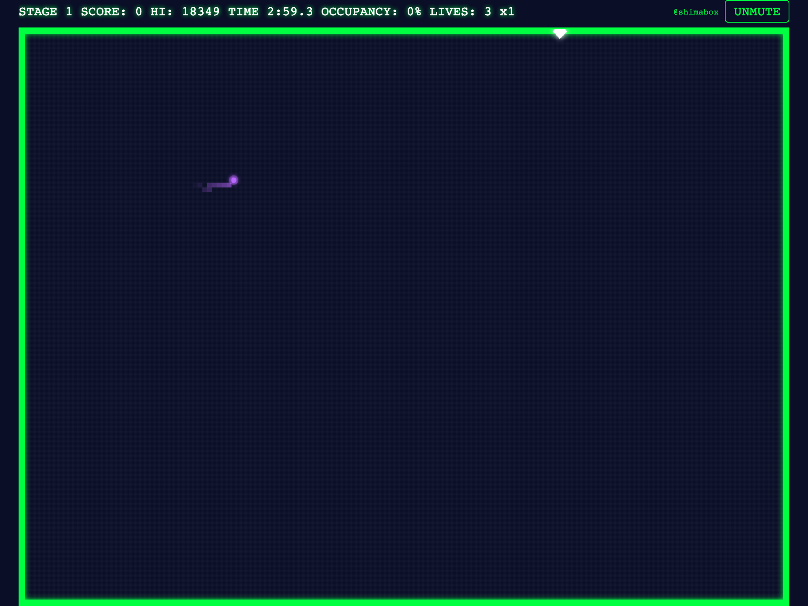

### 4-2. ラインボタンを押しながら進むと「線」が引ける

`X`/`Space`（または `FAST` ボタン）を**押しながら**フィールド内側へ進むと、
移動した跡が**黄色いライン**になります。

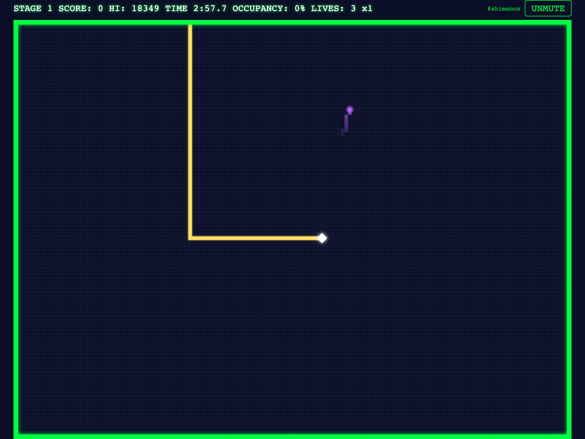

### 4-3. 反対側の境界線に届くと、面が確定する

ラインが別の境界線にたどり着くと線が閉じて、**フィールドが 2 つに分かれ、
「敵がいない側」が自分の陣地として塗りつぶされます**。

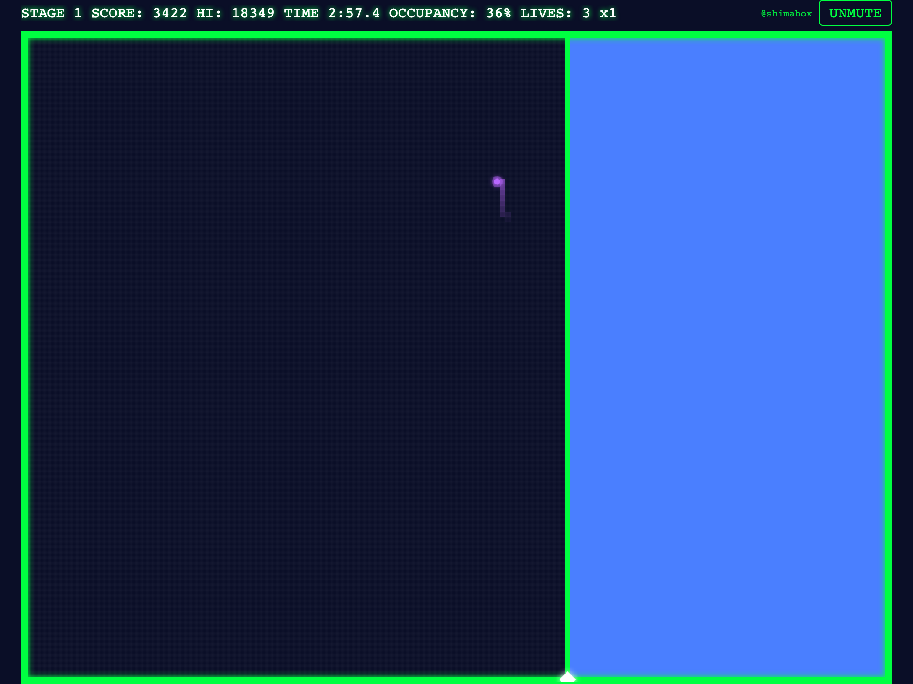

- 塗られた分だけ **OCCUPANCY（占有率）が増え、スコアが入ります**
- 敵がいる側は塗られません。**敵をどれだけ狭い場所に追い込んで大きく塗るか**がこのゲームの醍醐味です

### 4-4. 低速ライン（SLOW）は倍のスコア

`Z`/`Shift`（または `SLOW` ボタン）で引くと移動速度が**半分**になる代わりに、
確定したエリアの得点が **2 倍**になります。低速で取ったエリアは**赤色**で塗られます。

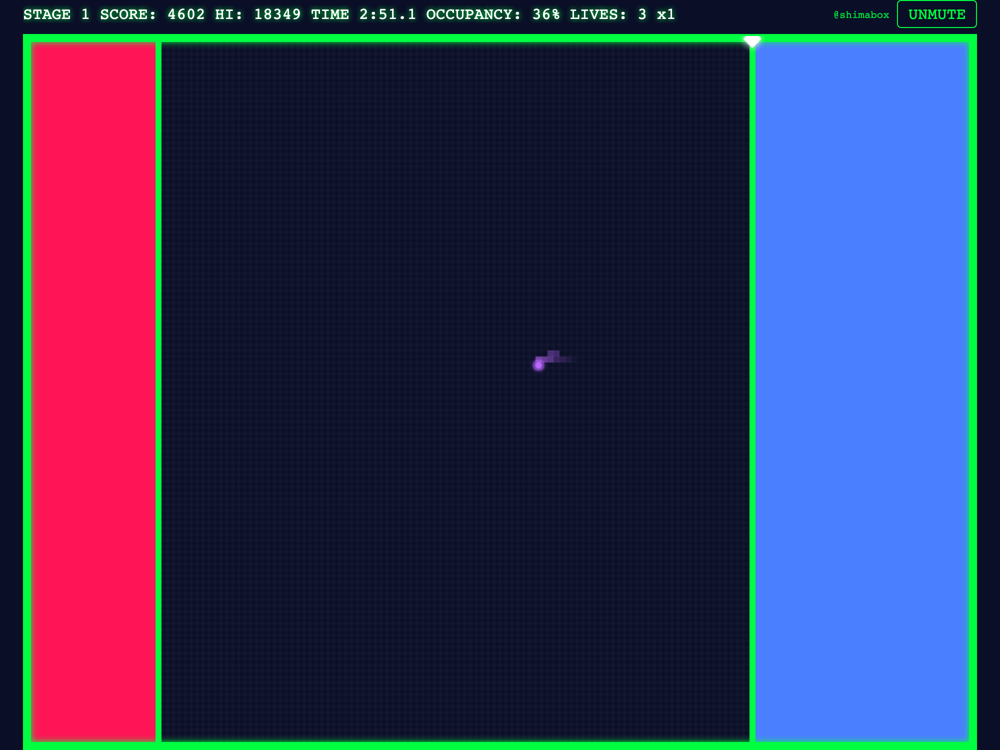

> ⚠️ 1 本のラインの途中で高速・低速を切り替えた場合は「高速で引いた」扱いになります。
> 全部を低速で引き切ったときだけ 2 倍です。

### 4-5. 引き返したくなったら「引き戻し」

ラインを引いている途中で**来た道を逆方向に入力**すると、ラインを末尾から消しながら後退できます。
開始地点まで戻れば、何もなかったことにしてやり直せます。


> ⚠️ 後述の**イグナイター（導火線の敵）が出現すると引き戻しできなくなります**。

---

## 5. 敵は 3 種類

### ウィスプ（Wisp）— フィールド内をさまよう本体

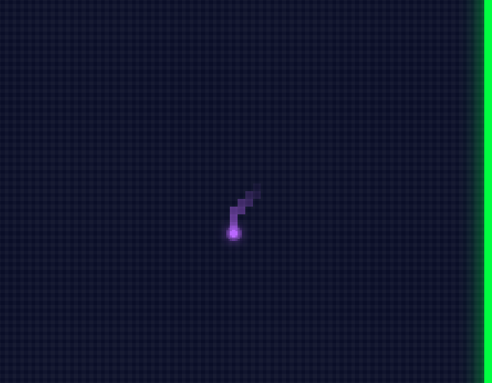

- フィールドの**未確定エリア内**をランダムに漂います
- **引いている途中のラインやマーカーに触れられるとミス**
- 確定済みの境界線の上にいるマーカーには**無害**です。枠の上にいれば安全
- こいつがいる側は陣地にならないので、動きを読んで反対側を切り取りましょう

### エンバー（Ember）— 境界線を巡回する追っ手

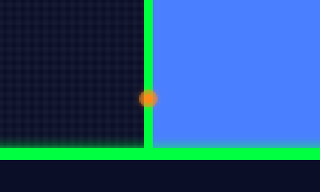

- 一定時間ごとに**画面上部から 2 体**現れ、**境界線の上**を移動してマーカーを追いかけます
- **接触するとミス**。枠の上に居座っていると追い詰められます
- ライン引き中（フィールド内側）には追ってこられません
- ただし **3 世代目以降に出現する深紅の個体（ブレイズ）** は例外で、引いている途中のライン上にも根元から登ってきます

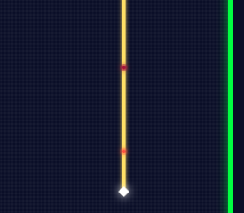

- ブレイズもエンバーと同じく**接触するとミス**。ラインを閉じれば境界巡回に戻りますが、ミスでラインが消えると足場を失って消滅します

### イグナイター（Igniter）— ラインを伝う導火線

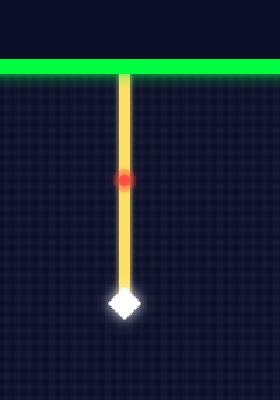

- ライン引きの途中で**約 1 秒立ち止まる**と、ラインの根元から出現します
- **あなたが止まっている間だけ**ライン上を迫ってきます。動けば止まります
- **追いつかれるとミス**。出現したら引き戻しもできません — 迷わず線を引き切りましょう

---

## 6. ミスとライフ


ミスになるのは次の 3 つです。

1. ウィスプが引いている途中のライン（またはライン上のマーカー）に触れた
2. エンバーがマーカーに接触した
3. イグナイターに追いつかれた

ミスをすると:

- 引いていたラインは**消滅**し、マーカーは**ライン開始地点に戻ります**
- **ライフが 1 減り**、得点倍率が **x1 にリセット**されます
- 直後の **約 2 秒間は無敵**です。ただしこの間は境界線の上を移動して安全な場所へ立て直すことしかできず、新しくラインを引き始めることはできません

**ライフが 0 になるとゲームオーバー**です。（**残り時間が 0 になった場合も、ライフの残数にかかわらず TIME UP でゲームオーバー**になります — 詳しくは 9 章）

---

## 7. ステージクリアと難易度

占有率が目標値に達した瞬間、ステージクリアです。目標を超えた分は**ボーナス得点**になります。

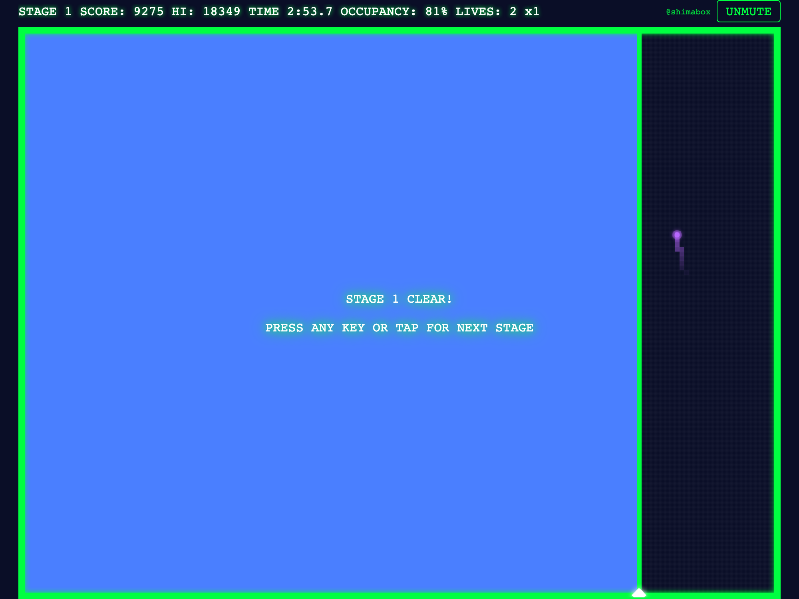

ステージが進むと難しくなります。**ステージ 1 から 10 に向けて全パラメータが少しずつ最大値まで上がっていき、ステージ 10 で「最も過酷な状態」に到達、11 面以降はそのまま据え置き**です。

| ステージ | ウィスプ | 速度 | エンバー移動間隔 | エンバー出現間隔 | エンバー同時数上限 | 目標占有率 |
|---|---|---|---|---|---|---|
| 1 | 1 匹 | 基準（x1.0） | 3 tick | 30 秒 | 2 体 | 65% |
| 3 | 3 匹 | x1.89 | 3 tick | 24 秒 | 4 体 | 71% |
| 5 | 5 匹 | x2.78 | 2 tick | 19 秒 | 6 体 | 76% |
| 10 | **10 匹** | **x5.0（最大）** | **1 tick（最速）** | **5 秒（最短）** | **10 体（最大）** | **90%（最大）** |

ステージ 11 以降はステージ 10 の値のまま変わりません。

スコアとライフは次のステージに引き継がれます。

---

## 8. 分断ボーナス — 一発逆転の大技

ステージ 2 以降はウィスプが **2 匹以上**になります（ウィスプの数はステージ数と同じ。ステージ 10 で最大の 10 匹）。

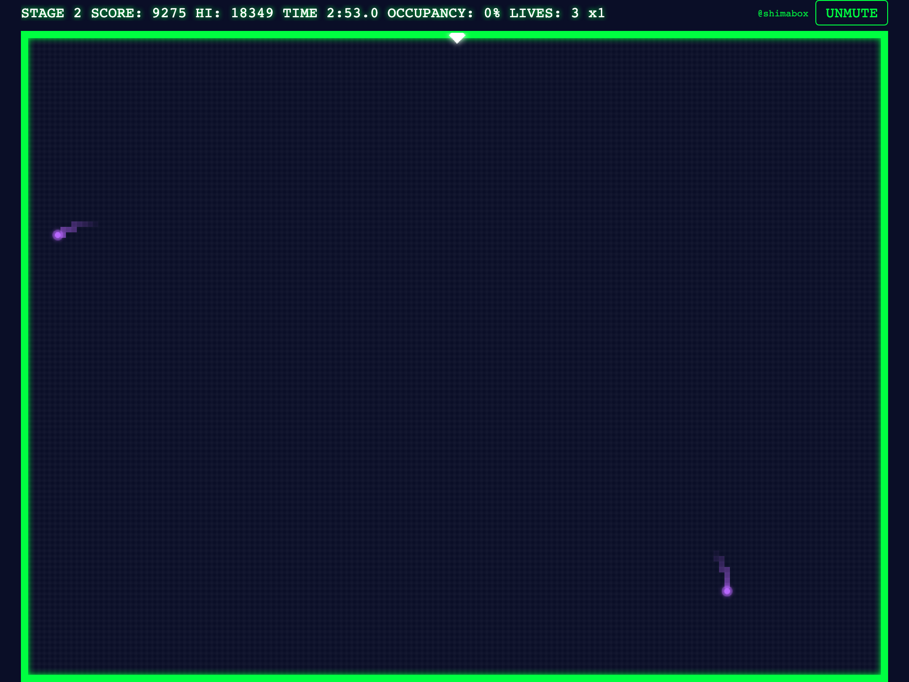

ここで狙えるのが**分断（スプリット）**です。
**2 匹のウィスプを 1 本のラインで別々の領域に切り分ける**と——

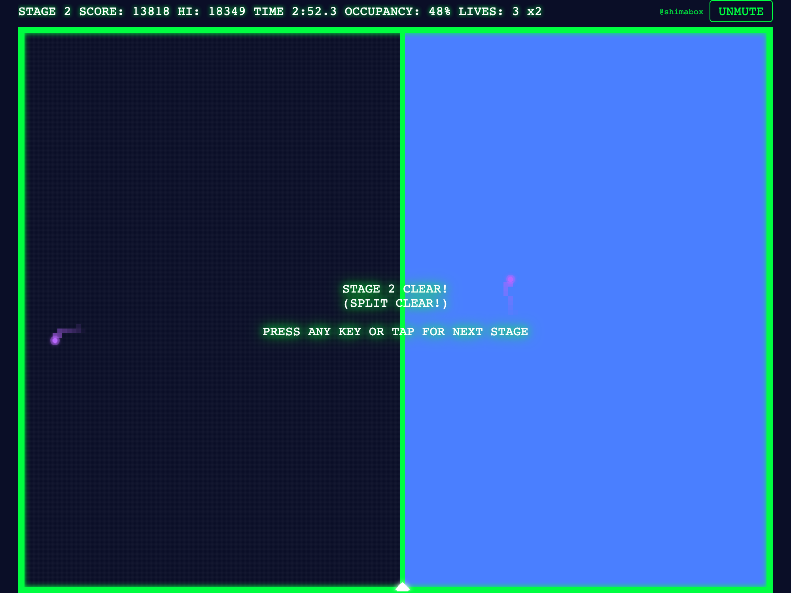

- **占有率に関係なく、その場で即ステージクリア!**（たとえ 10% 台でも）
- さらに次のステージから**得点倍率が上がります**（成功回数 +1 倍、最大 9 倍）
- ただし**一度でもミスすると倍率は x1 に戻ります**

分断の形は 2 通りあります。どちらも成立します。

1. **真っ二つ**: フィールドを横断するラインで、2 匹を左右（上下）の別領域に分ける
2. **閉じ込め**: 片方のウィスプごと小さく囲い込む。囲った側は確定エリアになり、中のウィスプと外のウィスプが「別々の領域」になるので分断成立

ハイスコアを狙うなら、リスクを取ってでも分断を決め続けるのが最短ルートです。

---

## 9. ゲームオーバーとハイスコア

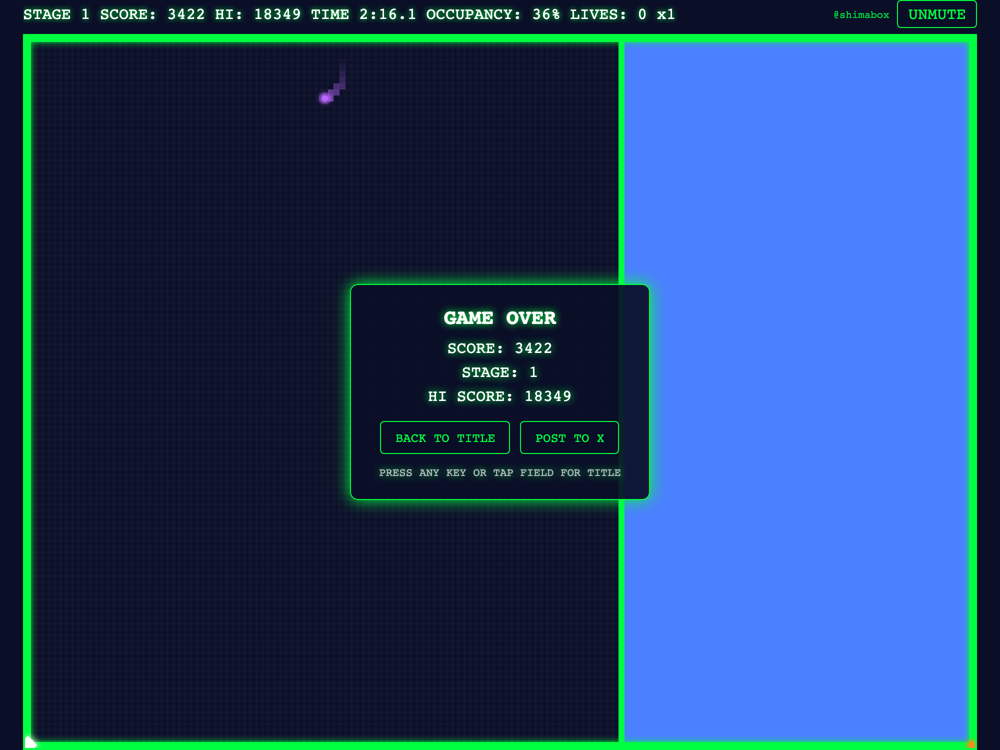

ゲームオーバーになるのは次の 2 パターンです。

- **ライフが 0 になった**（通常のゲームオーバー）
- **制限時間（実質 3 分）が 0 になった** — この場合はライフの残数に関係なく、画面に **TIME UP!** と表示されてゲームオーバーになります

ゲームオーバー画面の **POST TO X** ボタンで、そのプレイのスコア・到達ステージを X にシェアできます（スコア入りカード画像付き）。**BACK TO TITLE**（または何かキー/タップ）でタイトルに戻ります。
スコアが **TOP 10** に入る見込みのときは、ゲームオーバー画面に **YOU MADE THE TOP 10!** と投稿フォームが表示されます。投稿の方法は次の 10 章を参照してください。
**ハイスコアはブラウザに自動保存**され、次回起動時のタイトル画面に表示されます。このハイスコアは端末（ブラウザ）ごとの記録で、全プレイヤー共通のオンラインランキングとは別物です。

> 記録（ハイスコア）をリセットしたい場合は、ブラウザの開発者ツールを開き、localStorage から `qixxx.highScore` を削除してください。

---

## 10. スコアランキングとリプレイ

### 10-1. ランキングとは

全プレイヤー共通のオンラインランキングです。掲載されるのは**上位 10 件だけ**です。

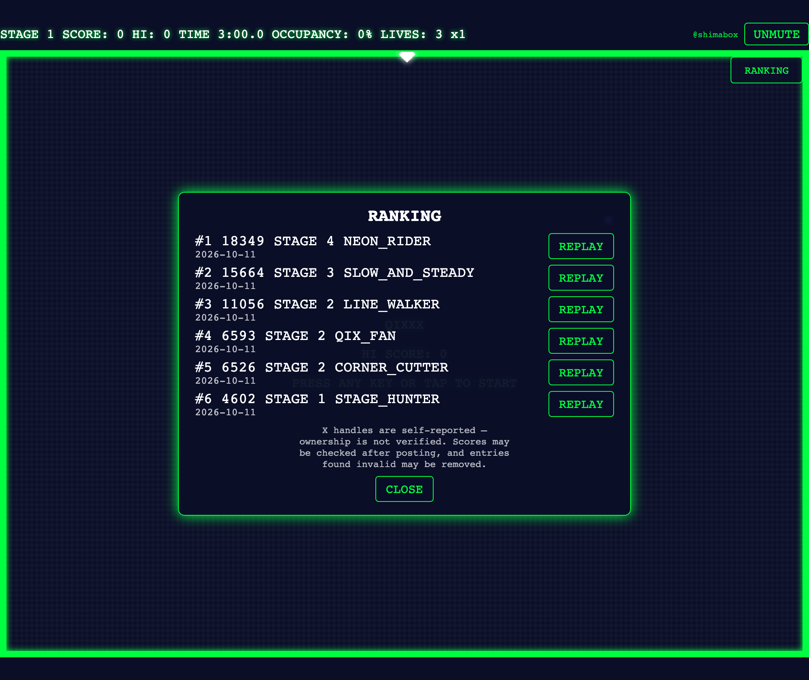

- タイトル画面の右上にある **RANKING** ボタンで開き、**CLOSE** で閉じます
- 各行には順位・スコア・到達ステージ・名前（または X ハンドル）と、投稿された日付が並びます
- エントリがまだないときは `NO ENTRIES YET` と表示されます
- **RANKING** ボタンがあるのはタイトル画面だけです。プレイ中は開けません

### 10-2. 投稿できる条件

ゲームオーバー画面に投稿フォームが表示されるのは、次の条件をすべて満たしたときです。

1. **通常のプレイであること。** URL に `?seed=` を付けた固定シードのプレイや、デバッグパネルで設定を変えたプレイは対象外です
2. **スコアが、確認済みのスコアの 10 位を上回ること。** 同点は対象外です。確認済みのスコアが 10 件に満たないときは、どのスコアでも投稿フォームが表示されます。この判定には確認待ちの投稿を含めないため、一覧では 10 位以内に届かないように見えるスコアでも、投稿できることがあります
3. **面の確定回数が上限（300 回）以内であること。** 2 を満たしていても、上限を超えたプレイは投稿できません。この場合はフォームの代わりに `TOO MANY AREA CLAIMS TO VERIFY (n > 300) — THIS RUN CANNOT BE RANKED.`（n はそのプレイの確定回数）と表示されます

1 または 2 を満たさないときは、投稿フォームもメッセージも表示されず、通常のゲームオーバー画面だけになります。

> ⚠️ **投稿は一度きりです。** ゲームオーバー画面を閉じてタイトルに戻ると、そのプレイは投稿できなくなります。

### 10-3. 投稿の流れ

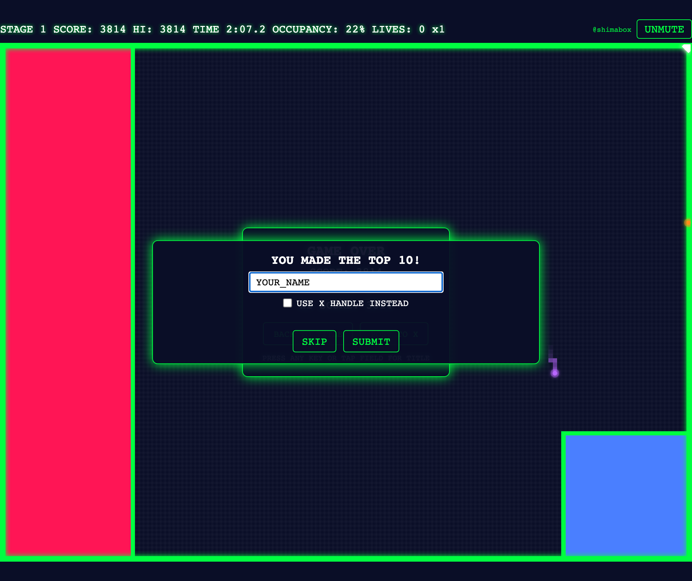

1. **NAME** 欄に名前（24 文字まで）を入力します
2. 名前の代わりに X ハンドルで投稿したいときは、**USE X HANDLE INSTEAD** にチェックを入れて `@handle` 欄に入力します（英数字と `_`、15 文字まで。先頭の `@` はあってもなくても構いません）
3. **SUBMIT** を押すと投稿されます。投稿しないときは **SKIP** を押します

名前も X ハンドルも空のまま **SUBMIT** を押すと、`ENTER A NAME OR X HANDLE.` と表示されます。

投稿後の表示の意味は次のとおりです。

| 表示 | 意味 |
|---|---|
| `SUBMITTED.` | 投稿を受け付けた |
| `SUBMITTED — PENDING VERIFICATION.` | 投稿を受け付けた。スコアはあとから確認されることがある |
| `NOT CURRENTLY IN CONTENTION FOR THE TOP 10 — NOT SAVED.` | 送信時点で圏外になっていた。保存されない |
| `SUBMIT FAILED — YOU CAN TRY AGAIN.` | 通信などの失敗。再送できる |

`SUBMITTED.` と `SUBMITTED — PENDING VERIFICATION.` は、どちらも投稿を受け付けたことを表す表示です。一覧に出るかどうかは、ほかの投稿との順位で決まります。
スコアの確認を待っている投稿も、表示の対象になれば、ほかの行と区別なく一覧に並びます。

このほか、入力内容に問題があるときや、一時的に受け付けられないときは、その旨のメッセージが表示されます。**SUBMIT** ボタンが残っている場合は、内容を直すか時間をおいてから送り直せます。

### 10-4. リプレイを見る

一覧の **REPLAY** を押すと、そのプレイをステージ 1 から再生して見られます。

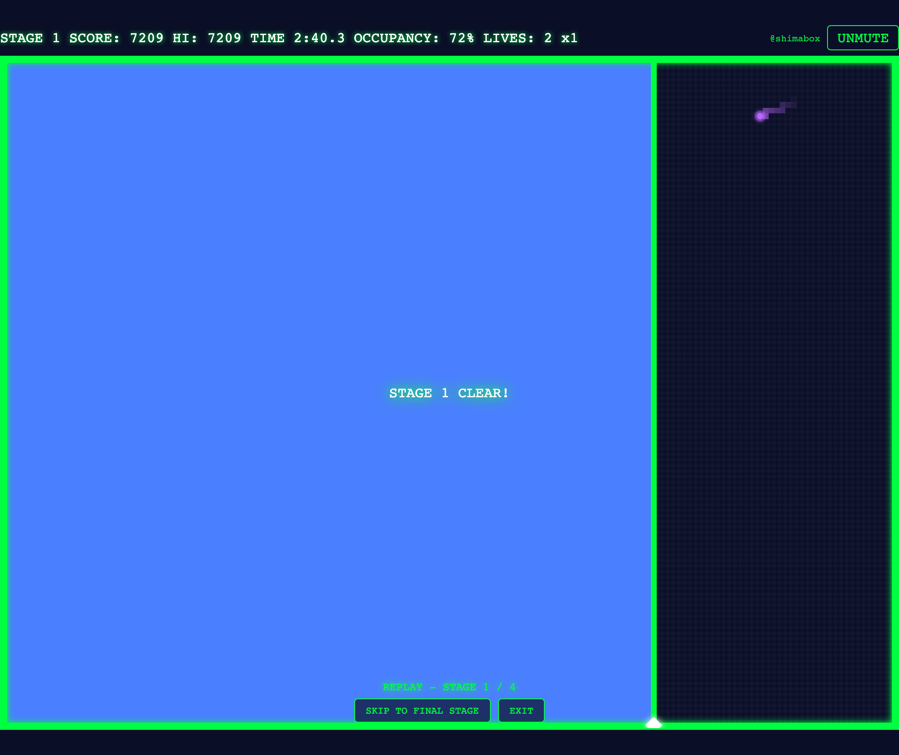

- 画面下に `REPLAY - STAGE n / N` と表示されます（n は再生中のステージ、N はそのプレイの最終ステージ）。最終ステージの再生中は末尾に `(FINAL STAGE)` が付きます
- ステージクリアの場面では `STAGE n CLEAR!` が約 1.5 秒表示され、自動で次のステージへ進みます
- **SKIP TO FINAL STAGE** で最終ステージまで飛ばせます
- 最後まで再生すると `GAME OVER - REPLAY END` とスコア・到達ステージが表示されます
- **EXIT** でランキング一覧に戻ります
- リプレイ中は音が鳴りません

### 10-5. 注意事項

- X ハンドルは自己申告で、本人確認はしていません
- 投稿されたスコアは後から確認されることがあり、不正と判断されたものは削除されることがあります
- ランキングは運営の判断でリセット（シーズン切替）されることがあります
- 短時間に多数のリクエストを送ると、一時的に受け付けられないことがあります

---

## 11. スコアまとめ

| 行動 | 得点 |
|---|---|
| 高速ラインでエリア確定 | 面積（セル数）× **0.5 点** × 倍率 |
| 低速ラインでエリア確定 | 面積（セル数）× **1.0 点** × 倍率 |
| ステージクリア時の超過ボーナス | （達成占有率 − 目標占有率）× 100 点 |
| 分断成功 | 即クリア + 次ステージから倍率アップ（最大 x9） |

---

## 12. 上達のコツ

- **最初は端から小さく削る。** 欲張って真ん中に長い線を引くほど、ウィスプに触られる時間が長くなります
- **ウィスプの位置を見てから引く。** 塗られるのは「ウィスプがいない側」。ウィスプが端に寄った瞬間が大きく取るチャンス
- **立ち止まらない。** ライン引き中に迷って止まるとイグナイターが出ます。引き始めたら一気に
- **低速ラインは仕上げに。** 残りわずかで安全な場所を低速で取ると、スコアが効率よく伸びます
- **エンバーの気配を感じたら移動。** 枠の上も安全地帯ではありません。同じ場所に留まらないこと
