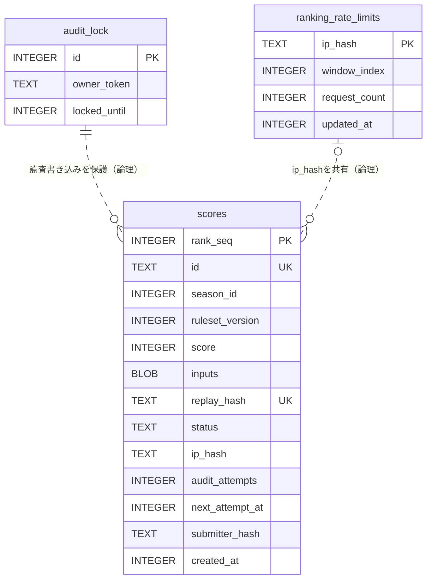

# ランキング D1 スキーマ設計書

## 1. 概要

ランキング機能は Cloudflare D1(SQLite)の次の3テーブルを使う。

| テーブル | 役割 |
| --- | --- |
| `scores` | 投稿されたリプレイと申告スコアを保持し、非同期監査後の確定ランキングを提供する。 |
| `audit_lock` | 非同期監査の多重実行を防ぎ、監査中の書き込みを所有者とリース期限で保護する。 |
| `ranking_rate_limits` | IP ハッシュごとの1時間固定窓の投稿回数を保持する。 |

マイグレーションはファイル名順に適用する。既存の列・テーブルを削除または改名せず、初期作成後の変更を追加だけで進める additive-only 方針である。

| 順序 | migration | 追加内容 |
| --- | --- | --- |
| 1 | `0001_create_scores.sql` | 基本の `scores` テーブルと、公開 ID・リプレイ重複防止・順位検索用インデックスを作成する。 |
| 2 | `0002_ranking_free_async.sql` | `scores` に非同期監査用の4列と4インデックスを追加し、単一行ロック `audit_lock` を作成する。既存スコアは既定値により `verified` になる。 |
| 3 | `0003_submitter_hash.sql` | pending 自己置換用の `submitter_hash` と候補検索用インデックスを追加する。 |
| 4 | `0004_ranking_rate_limits.sql` | D1 による固定窓レート制限テーブルと、窓・housekeeping 用インデックスを追加する。 |

## 2. ER 図



図の破線は外部キーではなく論理関係を表す。`scores.ip_hash` と `ranking_rate_limits.ip_hash` に `FOREIGN KEY` はなく、同じ `RANKING_IP_HASH_KEY` による HMAC 値を共有するだけである。`ranking_rate_limits` 行は `ip_hash` が NULL の行や housekeeping 後の行には対応しないため、対応する行は0または1件である。`audit_lock` も `scores` を参照せず、監査の各 `UPDATE` / `DELETE` が有効な `owner_token` と `locked_until` を同一 SQL 内で確認することで書き込みを保護する。

## 3. テーブルごとの詳細

### 3.1 `scores`

#### 目的

投稿されたゲーム結果と RLE リプレイを保存する。投稿直後は `pending` とし、別プロセスの監査で再シミュレーションした結果だけを `verified` に昇格させる。確定ランキングはシーズン・ルールセットごとの上位10件である。

#### カラム

| 名前 | 型 | NULL | 既定値 | 制約 | 意味と設計意図 |
| --- | --- | --- | --- | --- | --- |
| `rank_seq` | `INTEGER` | 不可 | 自動採番 | `PRIMARY KEY AUTOINCREMENT` | 内部行識別子兼、同点時の先着順。時刻やランダム ID では同時刻の到着順を保証できないため連番を使う。 |
| `id` | `TEXT` | 不可 | なし | UNIQUE index | 公開 API で使うランダムな共有 ID。主キーの連番を外部へ公開しない。 |
| `season_id` | `INTEGER` | 不可 | なし | なし | ランキングのシーズン。ルール変更を伴わないリセットを独立して表現する。 |
| `ruleset_version` | `INTEGER` | 不可 | なし | なし | ゲームルールの版。比較可能なスコアだけを同じランキングに載せる。 |
| `replay_format_version` | `INTEGER` | 不可 | なし | なし | リプレイ符号化形式の版。ルール変更と符号化変更を分離する。 |
| `score` | `INTEGER` | 不可 | なし | なし | 投稿時の申告スコア。監査成功時に再シミュレーション結果で明示的に上書きする。 |
| `stage` | `INTEGER` | 不可 | なし | なし | 投稿時の申告到達ステージ。監査成功時に再シミュレーション結果で上書きする。 |
| `name` | `TEXT` | 不可 | なし | なし | 表示名。形式制約は投稿 API の検証で担保する。 |
| `x_handle` | `TEXT` | 可 | なし | なし | 任意の X ハンドル。先頭の `@` を除いた形式で保存する。 |
| `seed` | `INTEGER` | 不可 | なし | なし | 決定論的な再シミュレーションに使うゲーム seed。 |
| `inputs` | `BLOB` | 不可 | なし | なし | PLAYING tick の入力列を RLE 符号化したバイト列。テキスト変換の膨張を避け、監査・リプレイ配信で元のバイト列を使う。 |
| `duration_ticks` | `INTEGER` | 不可 | なし | なし | RLE の decode-only 処理でサーバーが導出した tick 数。監査時に再シミュレーション結果と照合し、成功時に上書きする。 |
| `replay_hash` | `TEXT` | 不可 | なし | UNIQUE index | シーズン・ルールセット・seed・正規化済み入力列から計算するハッシュ。RLE の分割だけを変えた同一プレイも重複として拒否する。 |
| `created_at` | `INTEGER` | 不可 | なし | なし | 投稿時刻の Unix epoch **ミリ秒**。pending の24時間境界と先着データの保持に使う。 |
| `status` | `TEXT` | 不可 | `'verified'` | DDL の `CHECK` なし | コード上の値は `pending` または `verified`。既存行を再監査せず確定扱いにするため、追加時の既定値を `verified` とした。新規投稿は明示的に `pending` を設定する。 |
| `ip_hash` | `TEXT` | 可 | `NULL` | なし | `HMAC-SHA-256(RANKING_IP_HASH_KEY, CF-Connecting-IP)` の16進表現。ヘッダー欠落時の入力はリテラル `unknown`。pending のIP別上限に使う。列追加前の既存行は復元不能なので `NULL` を許す。 |
| `audit_attempts` | `INTEGER` | 不可 | `0` | なし | 予期しない監査例外の発生回数。確認済みの不正リプレイは再試行せず削除するため増加しない。 |
| `next_attempt_at` | `INTEGER` | 可 | `NULL` | なし | 次回監査可能時刻の Unix epoch **秒**。SQL の `unixepoch()` と直接比較するため秒単位にする。`NULL` は即時取得可能を表す。 |
| `submitter_hash` | `TEXT` | 可 | `NULL` | なし | ブラウザ生成の128 bit tokenをデコードした16バイトに対する鍵なし SHA-256。pending 自己置換の所有証明にだけ使い、verified 化と同時に `NULL` へ戻す。 |

DDL が直接保証する値域は少なく、`status`、スコア、ステージ、seed、名前などの妥当性は API と監査コードが担う。したがって、運用 SQL で行を直接追加・更新するときも同じ不変条件を崩してはならない。

#### インデックス

| インデックス | 列 | 対象クエリと理由 |
| --- | --- | --- |
| `INTEGER PRIMARY KEY` (rowid alias) | `rank_seq` | 監査チャンクの `ORDER BY rank_seq`、行単位の更新・削除、順位の同点先着順に使う。 |
| `idx_scores_id` (UNIQUE) | `id` | `GET /api/ranking/:id/replay` の公開 ID 単独検索と ID 一意性を支える。 |
| `idx_scores_replay_hash` (UNIQUE) | `replay_hash` | 投稿 INSERT 時に同一論理リプレイを一意制約違反として拒否する。 |
| `idx_scores_season_ruleset_rank` | `season_id, ruleset_version, score DESC, rank_seq ASC` | 0001 時点の同期ランキング取得・上位外削除用。非同期化後の現行クエリは `status` も絞るため、次の複合インデックスが対応する。 |
| `idx_scores_status_season_ruleset_rank` | `status, season_id, ruleset_version, score DESC, rank_seq ASC` | verified TOP10、10位閾値、pending 表示候補、監査後の verified TOP10 cleanup を同じ順位順で処理する。 |
| `idx_scores_pending_created` | `status, created_at` | 新規投稿の全体 pending 件数と、監査冒頭の24時間経過行削除を支える。 |
| `idx_scores_pending_ip_created` | `status, ip_hash, created_at` | 新規投稿と自己置換で、同一 IP ハッシュの fresh pending 件数を数える。 |
| `idx_scores_pending_rank_seq` | `status, rank_seq` | 監査が retry 可能な pending を先着順にチャンク取得する。`next_attempt_at IS NULL OR <=` はこの走査上で絞る。 |
| `idx_scores_pending_submitter` | `status, submitter_hash, score` | 所有する fresh pending から新スコア未満の最弱行を探す自己置換を支える。`created_at` は追加の範囲条件として絞る。 |

#### 状態遷移と不変条件

```text
投稿受理
  └─ pending (audit_attempts=0, next_attempt_at=NULL)
       ├─ 監査成功 ─────────────→ verified (submitter_hash=NULL)
       ├─ 確認済み不正 ─────────→ 削除
       ├─ 予期しない例外(1〜2回) → pending (audit_attempts++, next_attempt_at=unixepoch()+300)
       ├─ 予期しない例外(3回目) ─→ 削除
       ├─ created_atが24時間境界以前 → 削除
       └─ より高い自己投稿で置換 ─→ 削除し、新しいpendingを同一batchで追加
```

- fresh は `created_at > now_ms - 24h`、expired は `created_at <= now_ms - 24h`。境界ちょうどは expired である。
- 投稿時の fresh pending 上限は全体200件、同一 `ip_hash` 3件。`INSERT ... SELECT ... WHERE` 内で件数を確認して挿入までを1文にする。
- 自己置換は `submitter_hash` が一致し、新スコアより**厳密に低い**所有行だけが対象。同点は先着行を残す。最弱スコアが同点なら新しい `rank_seq` から置換する。
- 自己置換の `DELETE` と `INSERT` は同じ cutoff を使う同一 D1 batch で実行する。削除後も両上限を満たす場合だけ候補を削除し、挿入失敗時は batch 全体をロールバックする。
- verified ランキングの順序は `score DESC, rank_seq ASC`。監査の最後に現行シーズン・ルールセットの上位10件以外を削除する。
- 監査はシーズン・ルールセットで pending 取得を絞らない。古い版の残存 pending も取得し、版不一致として削除する。
- `audit_attempts` の最大回数3、retry delay 300秒はコード上の不変条件であり DDL の `CHECK` ではない。

### 3.2 `audit_lock`

#### 目的

複数 scheduler や手動実行が重なっても、同時に1つの監査だけが `scores` を変更できるようにする。migration が `id=1, owner_token='', locked_until=0` の初期行を投入し、以後は条件付き `UPDATE` だけで取得・更新・解放する。

#### カラム

| 名前 | 型 | NULL | 既定値 | 制約 | 意味と設計意図 |
| --- | --- | --- | --- | --- | --- |
| `id` | `INTEGER` | 不可 | なし | `PRIMARY KEY` | ロック行の識別子。コードは常に `id=1` を使う。DDL 自体に `id=1` の `CHECK` はない。 |
| `owner_token` | `TEXT` | 可 | なし | なし | 監査runごとのランダム16バイトを16進化した所有者 token。解放時は `NULL` にして所有権を消す。 |
| `locked_until` | `INTEGER` | 不可 | なし | なし | D1 の `unixepoch()` 基準のリース期限(秒)。Node 側時計とのずれを排除する。 |

主キー以外のインデックスはない。全クエリが `id=1` の1行を点検索するため追加インデックスは不要である。

#### 状態遷移と不変条件

- 未所有の初期状態は `owner_token=''`, `locked_until=0`。通常の解放後は `owner_token=NULL`, `locked_until=unixepoch()-1`。
- 取得は `id=1 AND locked_until < unixepoch()` のときだけ、新しい owner と10分後の期限を設定する。
- heartbeat と解放は owner が一致し、かつ期限内(`locked_until >= unixepoch()`)の場合だけ成功する。
- `LOCK_LEASE_SECONDS=600` は `AUDIT_MAX_RUNTIME_MS=300000`(5分)より長くなければならない。remote D1 の1要求上限30秒も、run予算とleaseの各10分の1以下でなければならない。
- 監査の全 `scores` 書き込みは、対象行条件とともに `EXISTS (SELECT 1 FROM audit_lock WHERE id=1 AND owner_token=? AND locked_until>=unixepoch())` を評価する。
- `meta.changes=0` は「対象なし」と「lease喪失」の両方を表し得るため、同じ fence 条件を再照会して区別する。

### 3.3 `ranking_rate_limits`

#### 目的

ランキング投稿を、IP ハッシュごとに1時間30回までの固定窓で制限する。IPごとに履歴を蓄積せず1行だけを更新し、古い行は監査コマンドの housekeeping で削除する。

#### カラム

| 名前 | 型 | NULL | 既定値 | 制約 | 意味と設計意図 |
| --- | --- | --- | --- | --- | --- |
| `ip_hash` | `TEXT` | 不可 | なし | `PRIMARY KEY` | IPごとの1行を特定する HMAC-SHA-256。生 IP を主キーにもログにも残さない。 |
| `window_index` | `INTEGER` | 不可 | なし | なし | `floor(now_ms / 3,600,000)` で求める1時間固定窓の番号。暦時の境界で全利用者の窓が切り替わる。 |
| `request_count` | `INTEGER` | 不可 | なし | `CHECK (request_count >= 1)` | 現在窓で消費済みの投稿回数。行の存在自体が少なくとも1回の消費を表す。 |
| `updated_at` | `INTEGER` | 不可 | なし | なし | 最後に許可された消費処理の Unix epoch 秒。古いIP行の削除基準にする。 |

#### インデックス

| インデックス | 列 | 対象クエリと理由 |
| --- | --- | --- |
| 主キーの自動インデックス | `ip_hash` | 投稿ごとの `ON CONFLICT(ip_hash)` UPSERT により1 IP 1行を原子的に更新する。 |
| `idx_ranking_rate_limits_window` | `window_index` | migration で作成されているが、現行の API・監査コードには `window_index` で行集合を検索するクエリはない。 |
| `idx_ranking_rate_limits_updated_at` | `updated_at` | housekeeping の `DELETE ... WHERE updated_at < now_seconds - 86400` を支える。 |

#### 状態遷移と不変条件

- 初回アクセスは `request_count=1` で挿入する。同じ窓では30まで1ずつ加算し、31回目以降は UPSERT の `WHERE` が偽になり `changes=0` となる。
- 新しい窓の最初のアクセスは、同じ行の `window_index` を更新して `request_count=1` に戻す。
- `request_count >= 1` はこのスキーマで明示された唯一の `CHECK` 制約である。
- housekeeping は `updated_at < now_seconds - 86400` の行だけを削除する。24時間ちょうどの行は残す。
- `updated_at` は許可された UPSERT でだけ更新される。上限到達後の拒否では行が変化しない。

## 4. 主要クエリと設計判断

### 投稿時

投稿 API は、安価な形式検証とD1レート制限の後に、verified の10位スコアを `OFFSET 9` で取得する。新スコアは閾値を厳密に超える必要があり、verified が10件未満なら `COALESCE(..., -1)` により非負スコアを通す。この事前ゲートは保存負荷を減らすための判定であり、並行投稿に対する整合性境界ではない。

整合性境界は pending INSERT 自身である。単一の `INSERT ... SELECT ... WHERE` が、同じ24時間 cutoff に対する全体200件・同一IP 3件の `COUNT(*)` と挿入をまとめる。上限到達時だけ、所有 token のある投稿は「自分のより低い fresh pending」1件を選び、削除と再挿入を同一 batch で試す。これにより、他人の行の削除、同点の後発優先、削除だけが確定する状態を避ける。

### 表示とリプレイ取得

確定境界用の `entries` は verified 上位10件だけを返す。画面用の `displayEntries` は verified 上位10件と fresh pending 上位3件を同じ `score DESC, rank_seq ASC` でmergeして10件に絞る。pending は表示だけに影響し、投稿可否の10位閾値を引き上げない。リプレイは `id` 単独で検索し、expired pending を最初に404、版不一致を次に410と判定する。

### 監査

監査は D1 時計で lock を取得し、その時点の `runStartedAt` を全チャンクの retry 判定に固定する。`status='pending' AND (next_attempt_at IS NULL OR next_attempt_at <= runStartedAt)` を `rank_seq` 順に最大50件取得するため、同じrunが自分で300秒後に設定した retry 行を再取得しない。

各チャンク前の heartbeat だけでは、その直後にleaseが切れる競合を防げない。このため、verified 化、retry予約、不正・期限切れ・試行上限到達・TOP10外の削除は、すべて対象行条件と lock の owner / expires 条件を**同一 SQL**で確認する fenced write にする。確認と更新を別SQLにすると、その間に別runがlockを取得でき、古い所有者の書き込みが混入する。

### レート制限と housekeeping

レート制限は `INSERT ... ON CONFLICT(ip_hash) DO UPDATE ... WHERE` の単一文である。同一窓なら上限未満の場合だけ加算し、別窓なら1へ戻す。許可判定は `meta.changes===1` なので、読み取り後に別文で更新する競合窓がない。原子性の境界はこの1文であり、前段の request 検証や後段の score INSERT とは同一transactionではない。したがって、レート枠はその後の本文・スコア検証が失敗しても消費される。

監査コマンドはスコア監査より前に、最後の許可更新から24時間を超えた `ranking_rate_limits` 行を `updated_at` で削除する。housekeeping の失敗はスコア監査を止めないが、コマンドを非0終了にする。

### 設計判断

- **KV ではなく D1**: 順位付き検索、複数条件の pending 件数、自己置換 batch、条件付き UPSERT、監査 lock の fenced write をSQLの一貫した境界で実装するため。
- **1 IP 1行**: リクエスト履歴を1件ずつ蓄積せず、保存量をIP数に抑えながら競合時も主キーUPSERTで更新するため。
- **固定窓**: `window_index` と件数だけで判定でき、rolling window のイベント履歴を不要にするため。
- **additive-only**: 既存の確定スコアを保持したまま非同期監査とレート制限を導入し、旧コードへ戻す際も追加スキーマを即時削除せずに済むため。
- **生 IP を保存しない**: IP は低エントロピーで通常のhashでは総当たり可能なため、秘密鍵付き HMAC の `ip_hash` だけを保存する。
- **`inputs` を BLOB にする**: RLE のバイナリをそのまま再シミュレーションと配信に使い、base64などの保存時膨張を避けるため。

## 5. 運用メモ

### migration の適用

リポジトリのルートで、対象を明示して適用する。

```sh
# ローカル D1
npx wrangler d1 migrations apply qixxx-scores --local

# remote D1（対象アカウントとDBを確認してから実行）
npx wrangler d1 migrations apply qixxx-scores --remote
```

コードより先に必要な migration を適用する。特にレート制限コードだけを先に配備すると、テーブル未作成のため投稿が fail-closed の500になる。

### ロールバック

まず利用コードと定期監査を安全な版へ戻す。追加した列・インデックス・テーブルは即時に `DROP` しない。D1 の migration を逆向きに適用せず、不要性とデータ保持要件を確認した後に、削除が必要なら別migrationとして扱う。監査済み行の verified 化や削除も自動では元に戻さない。

### プライバシー

- `ip_hash` は `RANKING_IP_HASH_KEY` を鍵とする HMAC-SHA-256 であり、生 IP を保存・ログ出力しない。鍵が未設定または空なら投稿 API と監査コマンドは D1 操作前に fail-closed で停止する。
- `RANKING_IP_HASH_KEY` はsecretとして管理し、ログ、文書、設定ファイルへ値を書かない。鍵を変えると同じIPでも別hashになり、既存のIP別pending件数やレート制限行と連続しなくなる。
- `submitter_hash` は高エントロピーな128 bit tokenのhashだが、ブラウザ間の突合に使えるためログへ出さない。生tokenは保存もログ出力もせず、verified 化時にhashを消す。
- `owner_token` も write fence の所有証明なのでログへ出さない。

### 関連文書

- [ランキング運用手順書](./ranking-runbook.md)
- [非同期監査運用手順書](./ranking-audit-runbook.md)
- [プロジェクト設計](./plan.md)
